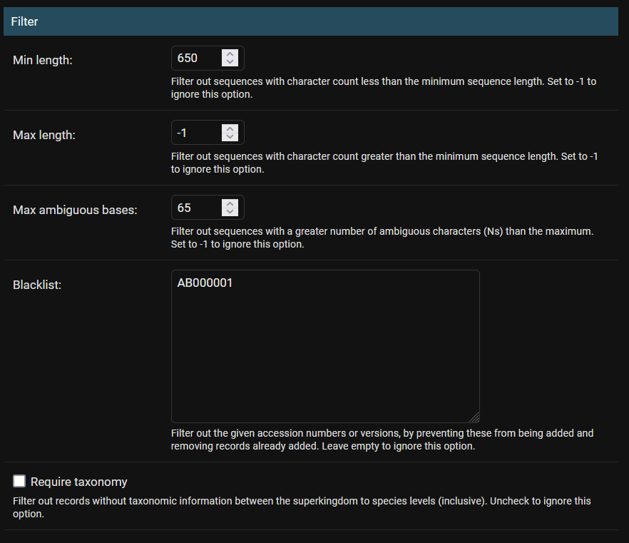

# Database Curation

On this page, you will learn:
- what is meant by "Reference Library" and "Blast Database" in Barrel
- how to create and curate your own reference library with the Barrel API Console
- how to update an existing reference library by adding or removing sequences

## Introduction to Reference Libraries and BLAST Databases

In Barrel, reference libraries are collections of sequences imported from GenBank or FASTA file uploads. To reflect the fact that reference libraries often change as new sequences are added or removed, libraries are organized into different versions each referred to as a BLAST Database.

For example, suppose your research project aims to construct a reference library for some freshwater fishes in South America. Then you would create a reference library for this, naming it "Fishes of South America" or some name similar. In this library you would then create a BLAST Database, and then add in your sequences in this BLAST database.

Reference libraries can only created by users with special permissions. Only users with superuser permissions are allowed to create reference libraries. Curation (i.e., modification) of these libraries is only permitted to superusers and other users granted access by superusers.

## Create your first reference library

Login into the Barrel API console as a superuser. On the home screen, click the `+ Add` button next to "Reference Libraries".

You will now see a form to "Add Reference Library". Fill in the following fields:

- Custom name: This is the name of the reference library. Give it something short but descriptive.
    - Example: "Fishes of South America"
- Description: The description is used to provide extra information that library users might find helpful. You may want to describe how these sequences were collected, what the purpose of the library is, and if there are any supporting publications for reference.
    - Example: "A library for biodiversity surveys of freshwater fishes in South America. Work not yet published".
- Public: Set whether or not this library will be visible to all users of the website. It is recommended to leave this unchecked (i.e., library will not be public), because we can set this to public at a later time such as when curation is complete.
    - Leave unchecked
- Marker Gene: Select what marker gene the library is for. Barrel currently only supports single-marker reference libraries. This option does not change analysis functionality and is just used for organizing libraries by marker gene.
    - Example: "CO1"

Then click "Save and continue editing". Barrel should show a green success message at the top with `The reference Library "Fishes of South America" Library (...) was added successfully. You may edit it again below`, meaning it has successfully saved all our entered data.

## Create your BLAST Database with a set of reference sequences

Our reference library is created, but we have not uploaded our reference sequences yet.

We want to create a BLAST Database under our newly-created library. On the left-side sidebar of the API Console, find "BLAST Database Versions" and click the "+ Add" button next to it.

### Details

You will now see a form to "Add Database Version". Under "Details", fill in the following fields:

- Library: Every BLAST Database belongs to a reference library, since it is simply a version for that library. Select the reference library we just created.
    - Example: "Fishes of South America" Library (...)
- Custom name: The name of the BLAST Database version. Name it something unique to this version of the library, so users can distinguish between versions easily.
    - Example: "Initial Pre-publication"
- Description: Add any additional info about the database version. For example, how were these sequences gathered, what criteria was used, when is the curation being performed, etc.
    - Example: "An initial version consisting of sequences found in lab papers."
- Version number: This is the version number of this BLAST database version within the context of the reference library. This will be auto-assigned when the version is locked, which will occur later.

For simplicity, skip the "Filter" section for now. Yes, these can be set right now but let's first upload our sequences.

### Import from GenBank

Skip to "Download GenBank accessions". In this section, we can specify what sequences we want from GenBank Nucleotide to be included in our new BLAST Database as reference sequences.
- Base database: Allows our new BLAST Database to inherit or copy accessions from an existing database, effectively cloning it. We will leave it empty ("--------") for now.
    - Example: Leave empty ("--------")
- Accession list upload: You can upload a .txt file from your computer which contains one accession number on each line
- Accession list text: You can paste in the accession numbers of the desired sequences, one per line.
- Search term: Instead of supplying specific accession numbers, you can provide an [advanced GenBank search query](https://www.ncbi.nlm.nih.gov/nuccore/advanced) and Barrel will attempt to include all sequences that GenBank returns for that query. Leave empty if not necessary
    - Example: "" (i.e., do not use query)

Now, click "Save and continue editing". Again there should be a success message at the top.

Check what has been uploaded to the database by scrolling to the bottom to "GENBANK ACCESSIONS". Click "SHOW" to view a list of all GenBank accessions that have been added to the database.

### Filter

What if we wanted to exclude sequences from being imported that we didn't want? Barrel gives us options to filter out sequences. For example, the following example excludes sequences less than 650bp or more than 65 N's, and also explicitly prevents accession AB000001 from being added to the database.

To use these settings, fill in the appropriate boxes and then click "Save and continue editing" at the bottom of the page. This will remove all **existing sequences** that do not pass the filter (i.e. a sequence that fails any of the checks will be removed). Additionally, if you are also adding sequences at that moment (i.e., you have accession numbers, search terms, or uploaded a file), then filter settings will also apply to those sequences that are to be added.

The **filter settings are not saved**, so the next time this database is saved no filter will be applied unless you enter new filter settings.

## Publish the BLAST Database

So our new BLAST database is ready for publication so that users can start running queries on it.

Under "Visibility", check the "Locked" checkbox. Then at the bottom of the page click "Save and Continue Editing". Barrel will now create the required files on the server so that queries can be run on the database. This step may take a minute or two to complete this step, especially if the database has a large number of sequences. Barrel should give a Success message when finished.

Now our BLAST database is ready for queries! If you go on the Barrel web application as your user and go to the BLAST run submission page, then this BLAST database version should now be selectable. 

Our BLAST database can be used but only superusers can see your library and run queries on it. Other users, such as new visitors on the website, cannot see it yet because the library is not yet public.

Back in the Barrel API Console, in the left sidebar, click Reference Libraries. In the list, find and click our "Fishes of Ontario" library that we have been making. Find the "Public" checkbox and click it. Then click "Save and continue editing". Our library is now marked as public. Now any user can visit your website, view the sequences in your database and also run queries through the Barrel web application.

