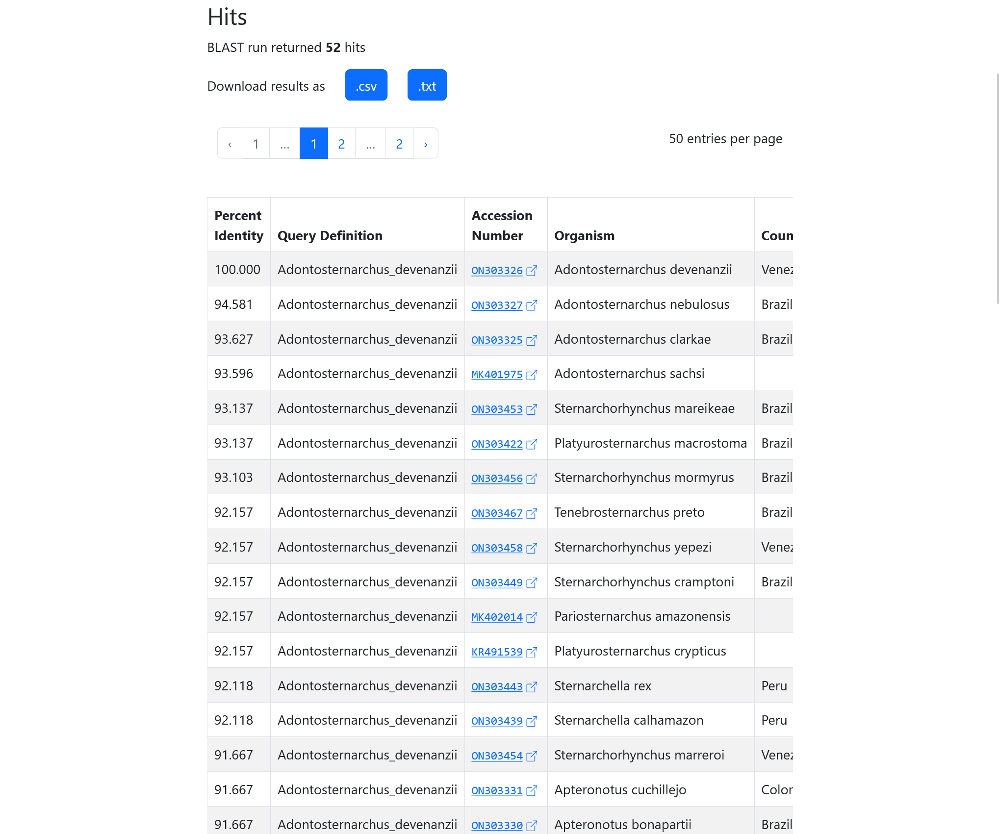
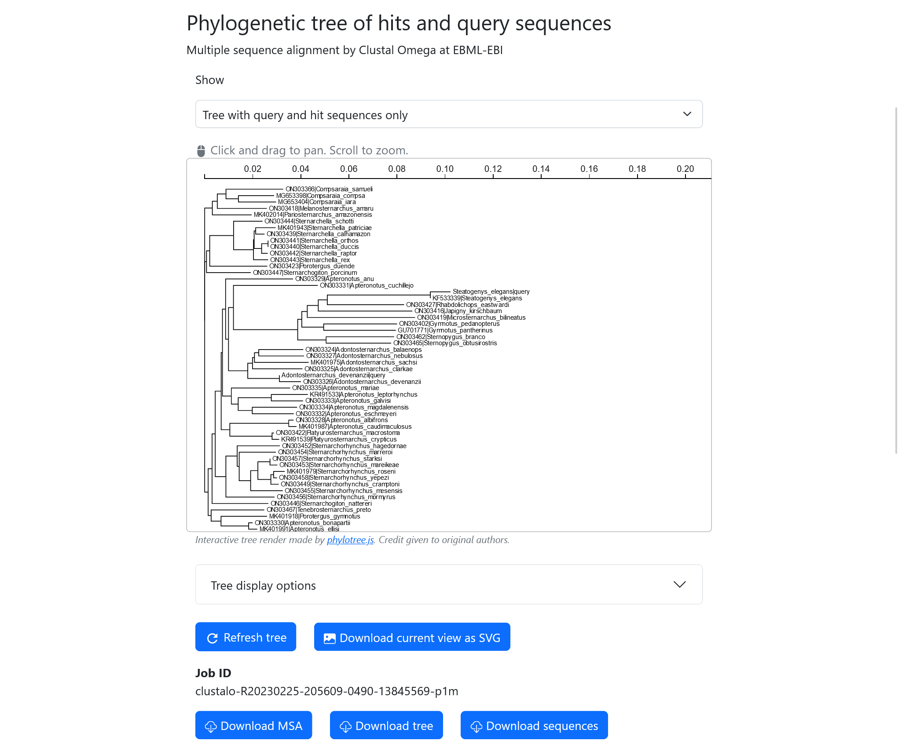

# Reading Barrel Results

## Hits

The BLASTN run will return a set of hits for each query sequence supplied. 



This is displayed in a table with the following columns:

-   **Percent Identity, Alignment Length, Evalue, Bit Score**: As computed by BLAST
-   **Query ID**: The Seq ID line corresponding to which of the query sequences the hit is for.
-   **Organism, Country, Specimen Voucher, Type, Latitude/Longitude**: As mined from GenBank, corresponding to source organism, `/country`, `/specimen_voucher`, `/type_material` and `/lat_lon`.
-   **Info**: Click to open a comprehensive summary of the sequence, including its modification dates and publication information.

## Multiple Alignments and Trees

The number of alignments performed will depend the multiple [alignment options selected](#multiple-alignment-and-tree-parameters).



For *each* tree there are three downloadable files, each directly obtained from the job ran on ClustalOmega at EMBL-EBI and unaltered:

-   Multiple sequence alignment (MSA): A `.clustal_num` file containing  an alignment with nucleotides numbered.
-   Phylogenetic tree: `.ph` file containing the phylogenetic tree in Newick (Phylip) format. Note that the web app also allows you to copy the raw Newick string.
-   Sequences: A `.txt` file containing the sequences submitted to perform the multiple sequence alignment, in FASTA format.

In all three files, the sequence identifiers of query sequences will be altered by appending `|query` at the end to denote these as query sequences. All non-query sequences (i.e. sequences from the database, such as hits) will have sequence identifiers in the format of `<accession_number>|<organism_name>`, where organism name is generally `<genus>_<species>`.

More information and additional examples of these files are available in the [documentation for ClustalOmega at EMBL-EBI](https://www.ebi.ac.uk/seqdb/confluence/display/JDSAT/Clustal+Omega+Help+and+Documentation).

## Taxonomy Assignment

Barrel will attempt to assign taxonomic identity based on the top BLAST hit as determined by percent identity, and this assignment is considered the "Classification Result". If multiple hits have identical values, then this result is a comma-separated list of all unique organisms with the highest percent-identity.

If a species identity was initially given with the query sequences, then the parsed identity is visible under "Original Classification". 

## Example Output
Unique Run Identifier: 1d86710c-dd8e-4906-bef1-20c533916848

### Hits Table

#### .csv
```text
# Barrel API
# id=1d86710c-dd8e-4906-bef1-20c533916848
# job_name=Example input and output
# db_used-id=ae47cd0a-b7b7-4dfe-9223-8e026d2980c5
# db_used-custom_name=Neotropical electric knifefish
# db_used-description=This BLAST database is a collection of barcodes from 167 species of Neotropical electric knifefish (Teleostei: Gymnotiformes) which was presented by Janzen et al. 2022. All sequences and related feature data are updated daily at midnight (UTC) from NCBI's Genbank database.
# job_start_time=2023-02-25T20:56:08.249742Z
# job_end_time=2023-02-25T20:57:59.175466Z
# job_error_time=NULL
"query_accession_version","subject_accession_version","percent_identity","alignment_length","mismatches","gap_opens","query_start","query_end","sequence_start","sequence_end","evalue","bit_score","accession_number","definition","organism","isolate","country","specimen_voucher"
"Adontosternarchus_devenanzii","ON303326","100.000","204","0","0","1","204","1","204","0.0000000000000000000000000000000000000000000000000000000000000000000000000000000000000000000000000000","377.0000000000000000000000000000000000000000000000000000000000000000000000000000000000000000000000000000","ON303326","Adontosternarchus devenanzii isolate 11011 cytochrome c oxidase subunit I (COX1) gene, partial cds; mitochondrial","Adontosternarchus devenanzii","11011","Venezuela","ANSP:198405"
"Adontosternarchus_devenanzii","ON303327","94.581","203","11","0","1","203","1","203","0.0000000000000000000000000000000000000000000000000000000000000000000000000000000000000002830000000000","315.0000000000000000000000000000000000000000000000000000000000000000000000000000000000000000000000000000","ON303327","Adontosternarchus nebulosus isolate 2892 cytochrome c oxidase subunit I (COX1) gene, partial cds; mitochondrial","Adontosternarchus nebulosus","2892","Brazil","MCP 39313"
...
"Adontosternarchus_devenanzii","ON303419","80.000","205","39","2","1","204","1","204","0.0000000000000000000000000000000000000084400000000000000000000000000000000000000000000000000000000000","150.0000000000000000000000000000000000000000000000000000000000000000000000000000000000000000000000000000","ON303419","Microsternarchus bilineatus isolate 2138 cytochrome c oxidase subunit I (COX1) gene, partial cds; mitochondrial","Microsternarchus bilineatus","2138","Brazil","MCP 45480"
"Steatogenys_elegans","KF533339","100.000","124","0","0","1","124","1","124","0.0000000000000000000000000000000000000000000000000000000000000060600000000000000000000000000000000000","230.0000000000000000000000000000000000000000000000000000000000000000000000000000000000000000000000000000","KF533339","Steatogenys elegans isolate 8807 cytochrome c oxidase subunit I (COI) gene, partial cds; mitochondrial","Steatogenys elegans","8807","Brazil: Negro","INPA 28860"
...
"Steatogenys_elegans","ON303416","83.636","110","18","0","13","122","1","110","0.0000000000000000000000003830000000000000000000000000000000000000000000000000000000000000000000000000","104.0000000000000000000000000000000000000000000000000000000000000000000000000000000000000000000000000000","ON303416","Japigny kirschbaum isolate 8992 cytochrome c oxidase subunit I (COX1) gene, partial cds; mitochondrial","Japigny kirschbaum","8992","French Guiana","MHNG:2682.031"
```

##### .txt
```text
# Barrel API
# id=1d86710c-dd8e-4906-bef1-20c533916848
# job_name=Example input and output
# db_used-id=ae47cd0a-b7b7-4dfe-9223-8e026d2980c5
# db_used-custom_name=Neotropical electric knifefish
# db_used-description=This BLAST database is a collection of barcodes from 167 species of Neotropical electric knifefish (Teleostei: Gymnotiformes) which was presented by Janzen et al. 2022. All sequences and related feature data are updated daily at midnight (UTC) from NCBI's Genbank database.
# job_start_time=2023-02-25T20:56:08.249742Z
# job_end_time=2023-02-25T20:57:59.175466Z
# job_error_time=NULL

# BLASTN 2.12.0+
# Query: Adontosternarchus_devenanzii
# Fields: query acc.ver, subject acc.ver, % identity, alignment length, mismatches, gap opens, q. start, q. end, s. start, s. end, evalue, bit score
# 49 hits found
Adontosternarchus_devenanzii	ON303326	100.000	204	0	0	1	204	1	204	3.56e-107	377
Adontosternarchus_devenanzii	ON303327	94.581	203	11	0	1	203	1	203	2.83e-88	315
...
Adontosternarchus_devenanzii	ON303419	80.000	205	39	2	1	204	1	204	8.44e-39	150
# BLASTN 2.12.0+
# Query: Steatogenys_elegans isolate 8807 cytochrome c oxidase subunit I (COI) gene, partial cds; mitochondrial
# Fields: query acc.ver, subject acc.ver, % identity, alignment length, mismatches, gap opens, q. start, q. end, s. start, s. end, evalue, bit score
# 3 hits found
Steatogenys_elegans	KF533339	100.000	124	0	0	1	124	1	124	6.06e-63	230
Steatogenys_elegans	ON303427	86.916	107	14	0	13	119	1	107	3.80e-30	121
Steatogenys_elegans	ON303416	83.636	110	18	0	13	122	1	110	3.83e-25	104
# BLAST processed 2 queries
```

### Multiple Alignments and Trees

Identical sets of files are generated for both the hit tree and database tree if these trees were specified to be generated by the input parameters. The text below is example text comprising the hit tree (alignment of query sequences plus only hits).

Job ID: clustalo-R20230225-205609-0490-13845569-p1m

#### Interactive tree plot 
The trees are rendered in the browser and can be saved as high-quality .svg files. [Look at this example.](./example-hit-tree.svg)

#### Alignment (.aln-clustal_num.clustal_num)
```text
	CLUSTAL O(1.2.4) multiple sequence alignment

ON303366|Compsaraia_samueli                  ------------ATGGTGTTTGGGGCCTGAGCGGGAATGATTGGTACTGCTTTAAGCCTT	48
MG653398|Compsaraia_compsa                   ------------------------------------------------------------	0
...
Adontosternarchus_devenanzii|query           ------------ATAGTGTTTGGCGCCTGAGCCGGTATAATTGGTACTGCTCTTAGCCTC	48
...
Steatogenys_elegans|query                    GGCACCCTTTATATAGTGTTTGGTGCCTGAGCCGGAATGGTTGGCACGGCCTTAAGCCTC	60
...
ON303402|Gymnotus_pedanopterus               ------------ATAGTATTTGGCGCCTGAGCTGGGATAATTGGCACAGCCTTAAGCCTC	48
GU701771|Gymnotus_pantherinus                -----CCTCTATATAGTATTTGGTGCCTGAGCCGGAATAATTGGCACAGCTTTAAGCCTT	55
                                                                                                         

ON303366|Compsaraia_samueli                  TTAATCCGGGCCGAGCTCAACCAACCAGGCGCCCTCCTAGGAGACGACCAAATTTACAAT	108
MG653398|Compsaraia_compsa                   --------------------CCAACCAGGCGCCCTCCTGGGAGACGACCAAATTTACAAT	40
Adontosternarchus_devenanzii|query           TTGATTCGAGCAGAGCTCAACCAACCAGGCACCCTCTTAGAAGACGACCAAATCTACAAC	108
...
Steatogenys_elegans|query                    CTTATTCGAGCCGAGCTAAGCCAACCCGGGGCCCTAATGGGTGATGACCAGATTTACAAT	120
...
ON303402|Gymnotus_pedanopterus               CTTATCCGAGCAGAACTAAGCCAACCCGGAGCCCTCCTTGGTGATGACCAAATTTATAAC	108
GU701771|Gymnotus_pantherinus                CTCATCCGAGCAGAACTAAGCCAACCCGGAGCCCTCCTCGGCGATGACCAAATTTATAAT	115
                                                                  ** ** **  *  *  * *  ** ** ** ** ** ** 

...

ON303366|Compsaraia_samueli                  -----	645
MG653398|Compsaraia_compsa                   -----	490
...
Adontosternarchus_devenanzii|query           -----	204
...
Steatogenys_elegans|query                    -----	124
...
ON303402|Gymnotus_pedanopterus               -----	645
GU701771|Gymnotus_pantherinus                -----	652
                                                  
```

##### Tree (.phylotree.ph)
```text
(
(
(
(
ON303366|Compsaraia_samueli:0.04945,
(
MG653398|Compsaraia_compsa:0.03075,
MG653404|Compsaraia_iara:0.03252)
:0.01075)
:0.00753,
ON303418|Melanosternarchus_amaru:0.04284)
:0.00422,
MK402014|Pariosternarchus_amazonensis:0.03389)
:0.00664,
(
(
(
ON303444|Sternarchella_schotti:0.02501,
(
(
(
MK401943|Sternarchella_patriciae:0.01720,
ON303439|Sternarchella_calhamazon:0.00760)
:0.00132,
(
(
ON303441|Sternarchella_orthos:0.00000,
ON303440|Sternarchella_duccis:0.00000)
:0.00555,
ON303442|Sternarchella_raptor:0.00530)
:0.00643)
:0.00056,
ON303443|Sternarchella_rex:0.01262)
:0.01724)
:0.02061,
ON303423|Porotergus_duende:0.04974)
:0.00273,
ON303447|Sternarchogiton_porcinum:0.03822)
:0.00158,
(
(
(
(
(
(
ON303329|Apteronotus_anu:0.05822,
(
(
ON303331|Apteronotus_cuchillejo:0.07279,
(
(
(
(
(
(
Steatogenys_elegans|query:0.01739,
KF533339|Steatogenys_elegans:-0.01739)
:0.08897,
ON303427|Rhabdolichops_eastwardi:0.06631)
:0.00773,
ON303416|Japigny_kirschbaum:0.08115)
:0.00954,
ON303419|Microsternarchus_bilineatus:0.09308)
:0.00470,
(
ON303402|Gymnotus_pedanopterus:0.06332,
GU701771|Gymnotus_pantherinus:0.06227)
:0.01887)
:0.00357,
(
ON303462|Sternopygus_branco:0.05865,
ON303465|Sternopygus_obtusirostris:0.05608)
:0.02457)
:0.05544)
:0.00426,
(
(
(
(
ON303324|Adontosternarchus_balaenops:0.03842,
ON303327|Adontosternarchus_nebulosus:0.03910)
:0.00368,
MK401975|Adontosternarchus_sachsi:0.04671)
:0.00176,
ON303325|Adontosternarchus_clarkae:0.04320)
:0.00405,
(
Adontosternarchus_devenanzii|query:-0.01856,
ON303326|Adontosternarchus_devenanzii:0.01856)
:0.02731)
:0.01662)
:0.00251)
:0.00273,
(
ON303335|Apteronotus_mariae:0.05082,
(
(
KR491533|Apteronotus_leptorhynchus:0.03152,
ON303333|Apteronotus_galvisi:0.02740)
:0.02855,
(
ON303334|Apteronotus_magdalenensis:0.03864,
ON303332|Apteronotus_eschmeyeri:0.03578)
:0.01215)
:0.00596)
:0.00767)
:0.00110,
(
(
ON303328|Apteronotus_albifrons:0.00414,
MK401987|Apteronotus_caudimaculosus:0.00674)
:0.05084,
(
ON303422|Platyurosternarchus_macrostoma:0.00162,
KR491539|Platyurosternarchus_crypticus:0.00614)
:0.03647)
:0.00748)
:0.00512,
(
(
ON303452|Sternarchorhynchus_hagedornae:0.03683,
(
ON303454|Sternarchorhynchus_marreroi:0.03166,
(
(
(
ON303457|Sternarchorhynchus_starksi:-0.00477,
ON303453|Sternarchorhynchus_mareikeae:0.00640)
:0.01045,
(
(
MK401979|Sternarchorhynchus_roseni:0.00955,
ON303458|Sternarchorhynchus_yepezi:0.00286)
:0.00243,
ON303449|Sternarchorhynchus_cramptoni:0.00687)
:0.01115)
:0.00627,
ON303455|Sternarchorhynchus_mesensis:0.02771)
:0.00989)
:0.00167)
:0.00978,
ON303456|Sternarchorhynchus_mormyrus:0.04197)
:0.00922)
:0.00273,
ON303446|Sternarchogiton_nattereri:0.04858)
:0.00338,
(
ON303467|Tenebrosternarchus_preto:0.04592,
(
MK401918|Porotergus_gymnotus:0.03974,
(
ON303330|Apteronotus_bonapartii:0.00341,
MK401991|Apteronotus_ellisi:0.00746)
:0.02390)
:0.00849)
:0.00259)
:0.00300);
```

##### Sequences (.sequence.txt)
```text
>Adontosternarchus_devenanzii|query Adontosternarchus_devenanzii
ATAGTGTTTGGCGCCTGAGCCGGTATAATTGGTACTGCTCTTAGCCTCTTGATTCGAGCA
GAGCTCAACCAACCAGGCACCCTCTTAGAAGACGACCAAATCTACAACGTAGCCGTTACC
GCCCATGCCTTCGTAATAATTTTCTTTATAGTTATGCCAATCATAATTGGAGGCTTTGGC
AACTGACTTATTCCCCTAATAATT
>Steatogenys_elegans|query Steatogenys_elegans isolate 8807 cytochrome c oxidase subunit I (COI) gene, partial cds; mitochondrial
GGCACCCTTTATATAGTGTTTGGTGCCTGAGCCGGAATGGTTGGCACGGCCTTAAGCCTC
CTTATTCGAGCCGAGCTAAGCCAACCCGGGGCCCTAATGGGTGATGACCAGATTTACAAT
GTTA
>ON303326|Adontosternarchus_devenanzii Adontosternarchus devenanzii isolate 11011 cytochrome c oxidase subunit I (COX1) gene, partial cds; mitochondrial
ATAGTGTTTGGCGCCTGAGCCGGTATAATTGGTACTGCTCTTAGCCTCTTGATTCGAGCA
GAGCTCAACCAACCAGGCACCCTCTTAGAAGACGACCAAATCTACAACGTAGCCGTTACC
GCCCATGCCTTCGTAATAATTTTCTTTATAGTTATGCCAATCATAATTGGAGGCTTTGGC
AACTGACTTATTCCCCTAATAATTGCCGCACCAGACATGGCATTCCCCCGAATAAATAAC
ATAAGCTTCTGACTGCTCCCCCCATCATTTTTCCTTCTTCTTGCCTCTGCCGGCTTAGAA
GCCGGAGTCGGGACAGGCTGAACCCTATACCCCCCTCTTGCTGGCAACGCTGCACACGCC
GGAGCTTCCGTAGACCTAACCATTTTCTCCCTCCACCTTGCCGGTGTCTCCTCCATCCTC
GGCTCCATCAACTTTATTACTACAATCATTAATATGAAACCCCCCACAATAACTCAATAT
CAGCTTCCATTGTTCATCTGATCCCTGCTAGTAACCACTGTGCTCTTATTACTCTCCCTC
CCTGTCCTAGCTGCCGGCATTACCATGCTTCTAACAGATCGAAATTTAAACACAGCATTC
TTTGACCCAACAGGAGGAGGTGATCCCATCCTGTATCAACACCTA
>ON303327|Adontosternarchus_nebulosus Adontosternarchus nebulosus isolate 2892 cytochrome c oxidase subunit I (COX1) gene, partial cds; mitochondrial
ATGGTGTTTGGCGCCTGAGCCGGTATAATTGGCACTGCTCTCAGCCTATTAATTCGAGCA
GAACTCAACCAACCGGGCACCCTCTTAGAAGACGACCAAATCTACAACGTAGCCGTAACC
GCTCATGCCTTCGTAATAATTTTCTTTATAGTTATGCCAATCATGATTGGAGGCTTTGGC
AATTGACTTATTCCCCTAATAATCGCCGCACCAGACATGGCATTCCCCCGAATAAATAAC
ATAAGCTTCTGGCTCCTCCCGCCATCATTCTTCCTTCTTCTTGCCTCTGCCGGCCTAGAA
GCTGGGGTCGGAACAGGCTGAACCCTATACCCCCCTCTTGCTGGCAACGCCGCACACGCC
GGAGCTTCCGTAGACCTGACCATTTTCTCCCTACACCTTGCCGGTGTCTCCTCAATCCTC
GGCTCCATTAACTTTATTACTACAATCATTAATATAAAACCCCCCACAATGACCCAGTAT
CAACTCCCATTATTTATTTGATCCCTACTAGTAACCACTGTGCTCCTACTACTTTCCCTC
CCAGTCCTAGCTGCCGGTATTACCATACTTCTCACAGACCGAAATTTAAATACAGCATTC
TTTGACCCCACAGGAGGAGGAGACCCCATCCTGTACCAACACCTA
>ON303325|Adontosternarchus_clarkae Adontosternarchus clarkae isolate 2906 cytochrome c oxidase subunit I (COX1) gene, partial cds; mitochondrial
ATAGTGTTTGGTGCCTGAGCCGGCATAATTGGAACTGCTCTCAGCCTGTTGATTCGGGCA
GAGCTCAACCAACCTGGCACTCTCTTAGAAGACGACCAAATTTATAACGTAGCCGTTACC
GCTCATGCCTTCGTAATAATTTTCTTTATAGTTATGCCAATCATAATTGGAGGCTTTGGC
AATTGACTTATCCCCCTAATAATTGCCGCCCCAGACATGGCATTCCCACGAATAAATAAC
ATAAGCTTTTGACTACTTCCCCCATCATTTTTCCTCCTTCTCGCCTCTGCTGGCTTAGAA
GCTGGAGTAGGAACAGGCTGAACCTTATACCCCCCTCTTGCTGGCAACGCCGCACACGCC
GGAGCTTCCGTAGACCTAACCATTTTCTCTCTCCACCTTGCCGGTGTCTCCTCCATCCTT
GGCTCTATCAACTTTATTACTACCATCATTAATATGAAACCCCCCACAATAACCCAATAT
CAACTCCCACTATTTATCTGATCCCTGCTAGTAACCACCGTACTCCTTCTCCTTTCTCTC
CCCGTTCTAGCTGCCGGCATTACCATACTTCTTACGGACCGAAATTTAAACACAGCATTC
TTTGACCCCACAGGAGGAGGAGACCCCATCCTGTACCAACACTTA
...
>ON303427|Rhabdolichops_eastwardi Rhabdolichops eastwardi isolate 2104 cytochrome c oxidase subunit I (COX1) gene, partial cds; mitochondrial
ATAGTATTTGGTGCCTGAGCCGGAATGGTTGGCACGGCCCTAAGCCTGCTAATTCGGGCA
GAGCTTAGTCAACCAGGTGCCCTTCTAGGCGATGACCAGATTTACAACGTAATCGTTACT
GCCCACGCCTTCGTAATAATTTTCTTCATGGTTATGCCCATTATGATTGGGGGCTTTGGA
AACTGACTCATCCCACTAATAATCGGCGCCCCCGACATAGCCTTCCCACGAATGAACAAC
ATAAGTTTCTGACTTCTGCCCCCCTCATTCCTCCTCCTCCTTGCCTCCTCTGGGGTCGAA
GCCGGGGCAGGAACAGGCTGAACCGTATATCCGCCCCTAGCCGGAAACCTCGCCCATGCT
GGCGCCTCCGTAGACCTAACTATCTTCTCACTCCACCTTGCCGGGGTCTCATCCATTTTA
GGCTCAATCAATTTTATTACAACAATTATCAACATAAAACCCCCTGCCATCTCACAATAC
CAAACCCCTCTATTTATCTGGGCCACCCTTGTAACCACAGTTCTTCTCCTACTCTCACTC
CCCGTCCTAGCTGCTGGCATCACCATGCTACTTACAGACCGAAATCTTAACACAACCTTC
TTTGACCCAGCAGGCGGAGGAGACCCCATTCTATATCAACACCTA
>ON303416|Japigny_kirschbaum Japigny kirschbaum isolate 8992 cytochrome c oxidase subunit I (COX1) gene, partial cds; mitochondrial
ATAGTATTTGGTGCCTGAGCCGGAATGGTTGGCACAGCTCTCAGCCTCTTAATCCGAGCG
GAGCTCAGCCAACCAGGGGCCCTTCTAGGGGACGACCAGATCTATAATGTGATCGTCACT
GCCCACGCTTTTGTCATAATTTTCTTCATGGTCATACCAATTATGATTGGAGGGTTTGGA
AACTGGCTTATTCCCCTAATAATTGGAGCCCCCGACATAGCCTTCCCACGAATAAACAAC
ATGAGCTTTTGACTTCTACCCCCGTCATTTCTCCTCCTACTCGCCTCATCCGGTGTAGAA
GCTGGAGCAGGGACAGGCTGAACCGTATACCCCCCTCTTGCCGGCAACCTCGCTCACGCA
GGGGCTTCAGTAGACCTCACCATTTTCTCCCTCCATTTAGCCGGTGTCTCCTCTATTTTG
GGCTCAATCAACTTCATCACAACTATTATTAACATAAAACCACCAGCCATCTCCCAATAT
CAAACCCCATTATTCATCTGAGCTACCCTAGTAACTACCGTGCTACTTCTCCTCTCACTG
CCCGTTCTGGCCGCTGGCATCACCATGCTGCTAACAGACCGAAACCTCAACACAACCTTC
TTTGACCCAGCAGGAGGAGGAGACCCAATTCTTTACCAACACCTG
```

##### Copy of Original Input

```text
>Adontosternarchus_devenanzii
ATAGTGTTTGGCGCCTGAGCCGGTATAATTGGTACTGCTCTTAGCCTCTTGATTCGAGCAGAGCTCAACCAACCAGGCACCCTCTTAGAAGACGACCAAATCTACAACGTAGCCGTTACCGCCCATGCCTTCGTAATAATTTTCTTTATAGTTATGCCAATCATAATTGGAGGCTTTGGCAACTGACTTATTCCCCTAATAATT
>Steatogenys_elegans isolate 8807 cytochrome c oxidase subunit I (COI) gene, partial cds; mitochondrial
GGCACCCTTTATATAGTGTTTGGTGCCTGAGCCGGAATGGTTGGCACGGCCTTAAGCCTCCTTATTCGAGCCGAGCTAAGCCAACCCGGGGCCCTAATGGGTGATGACCAGATTTACAATGTTA
```